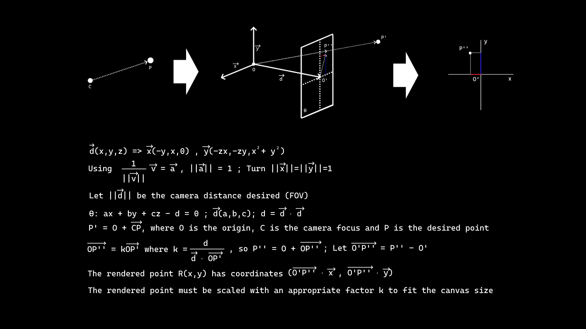

# Overview
This was a summer project that arose from the questions:

* How would I build a very basic 3D renderer without previous knowledge?
* How could I simulate orbits numerically? 

This was my (naïve and experimental) solution. Not all the planned functionalities are working (settings and creating worlds).
DISCLAIMERS: The code isn't very tidy as I was feeling very experimental with this project. Nonetheless, it serves as a simple example of 3D graphics and basic physics. The classes are all in .h files (I was experimenting to see if it'd be better than doing cpp and h (spoiler: it's not)).


# The Renderer

The 3D Renderer was built using the usual cross and dot products in R^3 and some geometric trickery, as seen in the image below.
To render the planets I simply render two points: One along the center and another in the radius of the planet, and bind the image to that section.
The planets are sorted (quicksort) in terms of distance before rendering.




# Worlds

The program comes with a `file manager` to save and load files, as well as a simple script for the world save files.
The scripts are contained in a world.dat file inside the world folders, which the program detects and considers valid.
To make new worlds simply copy an existing preset worlds and feel free to edit the world.dat!
Here are the world 'scripts':

Camera Center Position (x,y,z)
```
camera_center x y z
```
Camera Angles xAngle->\[-pi,pi\] yAngle->\[-pi/2,pi/2\]:
```
camera_angles xAngle yAngle
```
Planet informations (the planet texture must be 0 because not all functionalities were added, as previously mentioned):
```
planet_colour R G B
planet_position X Y Z
planet_velocity Vx Vy Vz
planet_mass M
planet_radius R
planet_texture 0
```
Create a planet (with previously stated information about the planet):
Note: You can create multiple copies of a planet by 'spamming' create_planet.
```
create_planet
```

I have also implemented a `python` script to generate a random world. Just run `rand_world.py` and the world information will be added to `random.dat`


# The Physics

The orbits are calculated using [Newton's Law of Gravitation](https://en.wikipedia.org/wiki/Newton%27s_law_of_universal_gravitation), the simplest way to describe gravity:

$F = G{m*M \over r^2}$

F: generated gravitational force (Newton)

m: mass of object 1 (Kilogram)

M: mass of object 2 (Kilogram)

G: constant of gravitation (m^3s^-2kg^-1)

r: distance between centers of mass (Meters)


The implementation is far from rigorous, but it serves it's purpose.
Naturally I did not solve any complicated analytical expressions, that would be quite impossible for more than two bodies if not for some special cases.
What I did is simply, for small `dt`, which I will call a `time step` - The change of position is calculated from the velocity `v*dt`, which changes according to the acceleration `a*dt` which is obtained from the famous `F=ma` and the formula shown before.
This is a mere numerical approximation to the 'real thing' - [Euler's Method](https://en.wikipedia.org/wiki/Euler_method).
Despite it's pompous name, it should be very natural and familiar for anyone who has played video-games before (in fact, I didn't know the name of this procedure when making the project, it's simply intuitive).


# Make the damn thing run!

The program might not work right away, You'll need to link SDL2main and SDL2image, as well as dll files (Windows).

# Enjoy!!
